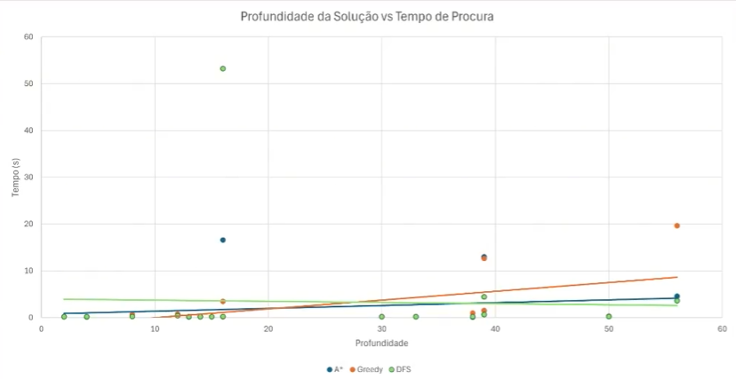

# Overview

This was developed as part of the **Artificial Intelligence  (IA)** course at IST-UL.
The objective was to create an efficient solver for the japanese puzzle game LITS (Nuruomino) using search algorithms and AI strategies.

- Use [nuruomino.py](https://github.com/dzpan0/IST-IA/blob/main/LITS/nuruomino.py) to solve a puzzle.
- Use [nuruomino_graph.py](https://github.com/dzpan0/IST-IA/blob/main/LITS/nuruomino_graph.py) to solve and visualize the final result solving process.
  + Creates a image for each piece placement and a gif animating the placement process. Can be found in nuruomino_graphs/current (execution will delete previous graph in this directory)

# Algorithm

The final deliverable uses DFS with forward checking as it had the best performance with more complex puzzles. A* came as a close second, showing better performance with higher depth puzzle solutions.

Depth of the solution encountered in the x-axis and Time(in seconds) in the y-axis

A more detailed analisis can be found [here](https://youtu.be/KfRxYxphcBg) (in Portuguese).

# Technologies

- [Python](https://www.python.org/downloads/)
